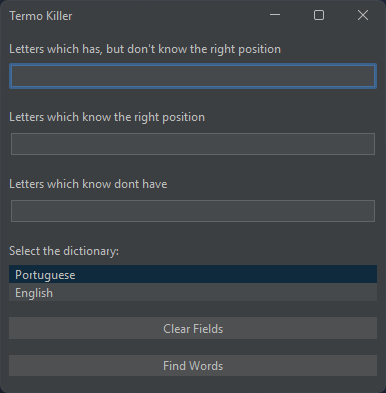

# TermoKiller

## About

App in Java Swing to help with wordle like games.

## How to build

Run the __`build.bat`__ file for _Windows_ or __`build.sh`__ for _Linux_, both are in the root directory of this project

> After execution, the file __`termo-killer-1.0.0.jar`__ will be generated in the directory `target`

## How to use

After build, run following command to start:

```shell
java -jar termo-killer-1.0.0.jar
```

## Screenshot

<p align="center" width="100%">
    
</p>